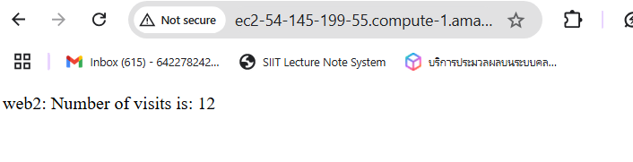
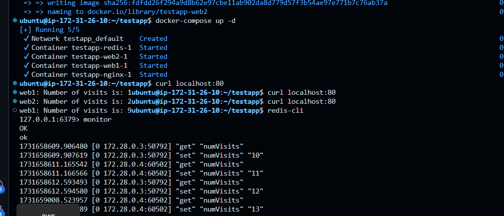

### Steps to Rebuild and Restart the Web Service

1. **Rebuild the `web` Service**:
   Run the following command to rebuild the `web` service:
   ```bash
   docker-compose build web1
   docker-compose build web2
   ```

2. **Restart the Docker Compose Setup**:
   After rebuilding, restart the services to ensure the updated `server.js` file is used:
   ```bash
   docker-compose down
   docker-compose up -d
   ```

3. **Test the Application**:
   After everything is up and running, test the endpoint again by accessing it in your browser or with `curl`:
   ```bash
   curl localhost:80
   ```
   This should show the correct visit count, starting from `1` and incrementing each time you refresh.


5. **Optional: Clear the Redis Key (if needed)**:
   - If you want to reset the `visits` key in Redis to test from scratch, you can use `redis-cli` to delete the key:
     ```bash
     curl localhost:80
     sudo apt-get install redis-tools
     redis-cli -h localhost -p 6379
     del visits
     redis cli
     > monitor
     ```

### Explanation

- **Initializing the `visits` Key**: The code now checks if `visits` is `null` and initializes it if necessary.
- **Rebuilding the Containers**: Rebuilding ensures that the updated `server.js` file is applied to the `web1` and `web2` services.

After these changes, you should see the visit count incrementing as expected. Let me know if it works!